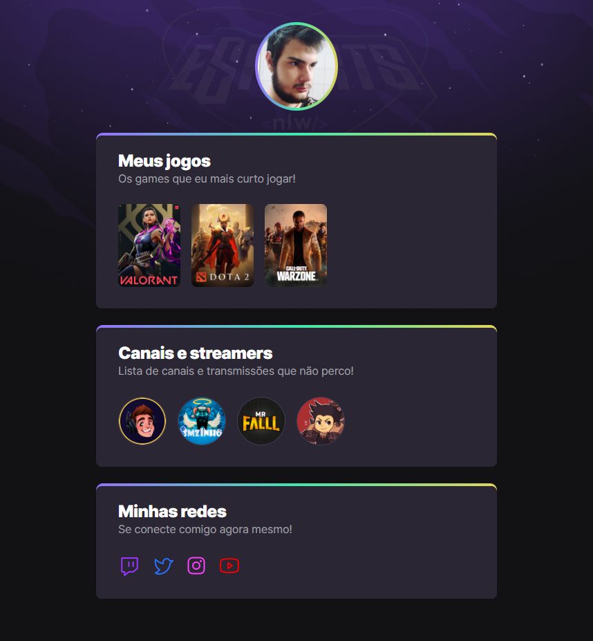

# NLW eSports

>Trilha Explore

Projeto feito no evento Next Level UP (NLW) da rocketseat.
Evento que durou uma semana e com muito conteúdo, foi muito bom pra eu aprende mais, e exercita o que já sabia.

[Clique aqui para acessar](https://gabriel-vitebo.github.io/NLW-eSports-explore/)

## Tecnologias 
- HTML
- CSS
- Git e Github

## O que aprendi

- Aprendi a coolocar degradê no fundo de algum elemento, seja um card ou uma imagem.
- Importa links externos.
- Colocar um fundo com uma imagem que fique sempre centralizado e que não perde a qualidade

## Contato

vitebo@outlook.com
